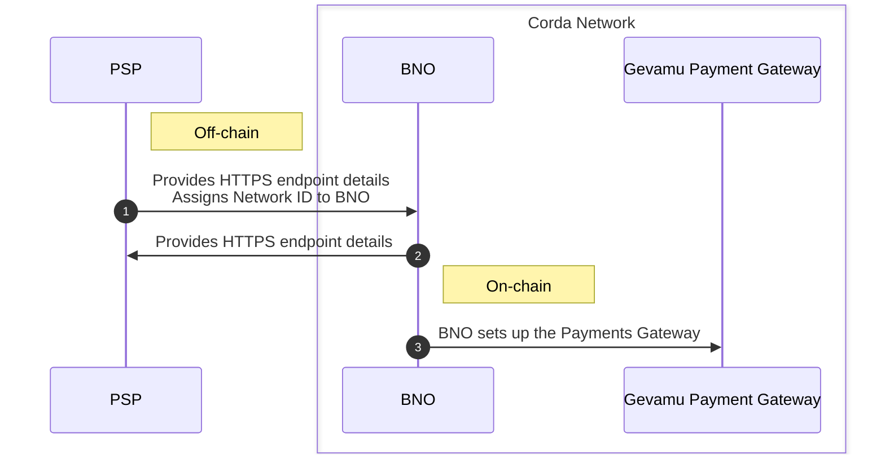

# 1. BNO onboarding

The BNO onboarding process consists of the following steps:

1. The PSP provides HTTPS endpoint details, and assigns a Network ID to the BNO.
2. The BNO provides HTTPS endpoint details to the PSP.
3. The BNO sets up the Payments Gateway as a node within their Corda network (Gevamu Payments Gateway binaries are provided by Exactpro) using configuration details exchanged previously.

