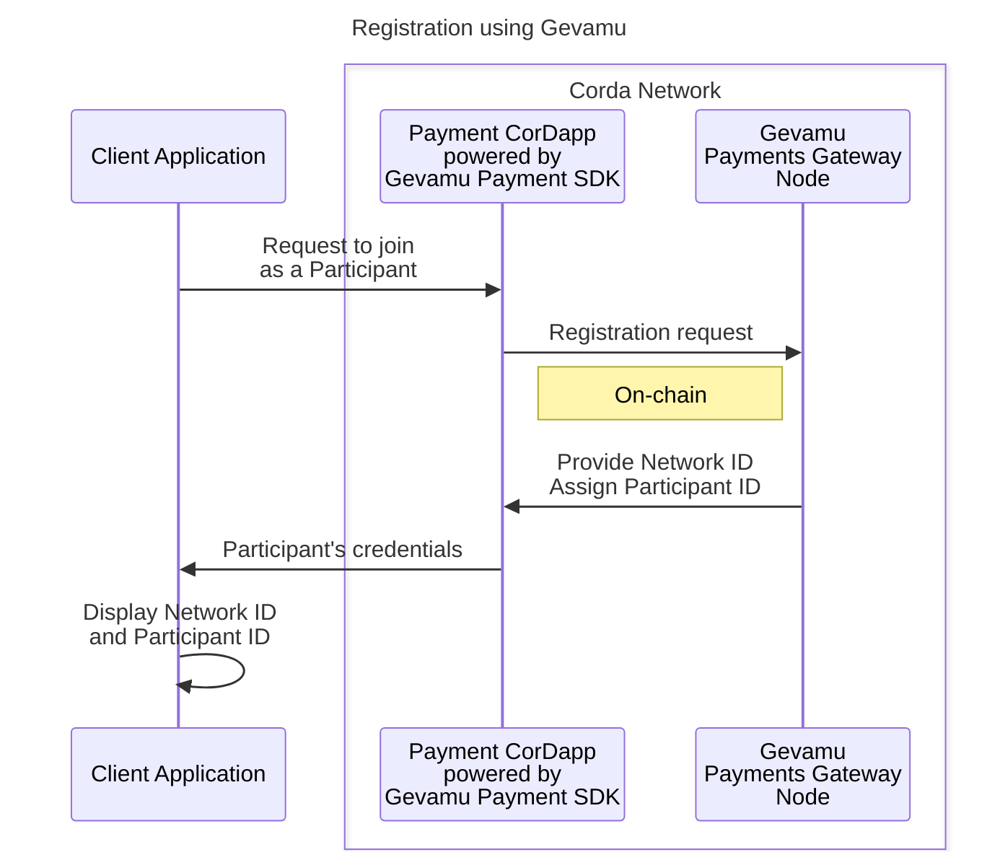
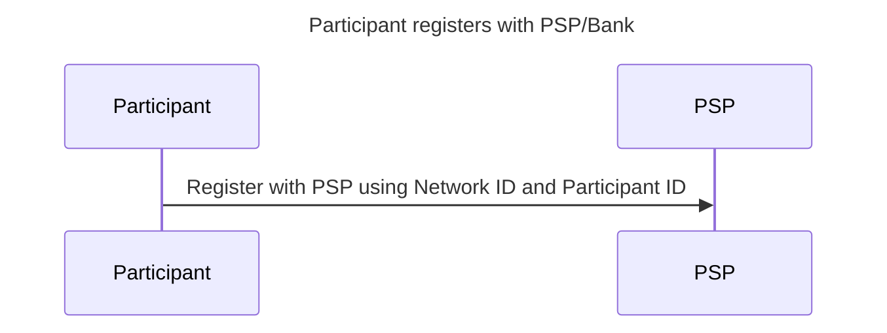

# 2. Participant onboarding

To onboard the Participant, the following steps are performed:

1. The Participant requests to join the Payments network.
2. Gevamu Payments Gateway provides the Participant with the Network ID, assigns them a Participant ID, and registers the Payments CorDapp.

::notice{info}

  These IDs are required when initiating payments.  The SDK does not have a functionality to save them – saving these IDs is the task of the application that uses the SDK.

::

3. Network ID and Participant ID are displayed in the Client Application. 

4. (Off-Chain) To access the payments service, the Participant registers with the PSP directly by submitting the combination of the Network ID and Participant ID received from the Payments Gateway.

