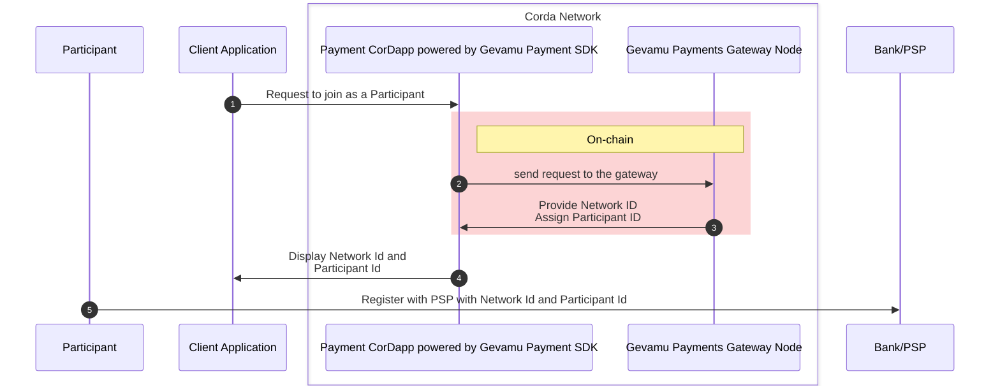

# 2. Participant onboarding

To onboard the Participant, the following steps are performed:

::notice{info}
  
  Prerequisite: the Participant has installed a custom CorDapp developed by the BNO or a 3rd party and enhanced with the functionality added by Gevamu Payment SDK.

::

1. The Participant requests to join the Payments network.
2. Gevamu Payments Gateway provides the Participant with the Network ID, assigns them a Participant ID, and registers the Payments CorDapp.
3. Network ID and Participant ID are displayed in the Client Application.
4. To access the payments service, the Participant registers with the PSP directly by submitting the combination of the Network ID and Participant ID received from the Payments Gateway.

