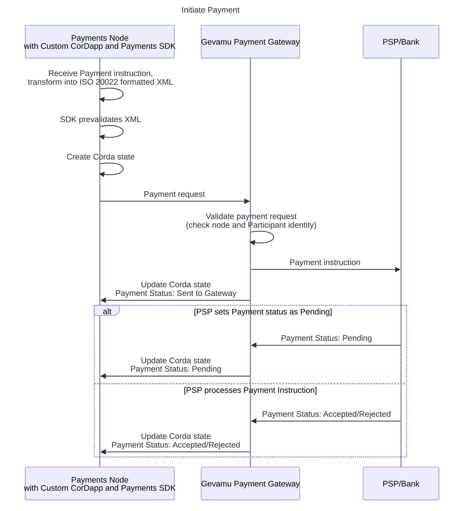

# 3. Payment initiation

1. The Participant initiates the payment transaction off-chain via a Web UI. The payment request is handled by a web server on the Participant’s node of the Corda business network and sent via Corda RPC to the custom Payment CorDapp installed on the Participant’s node on-chain.

2. The Participant’s request is accepted by the CorDapp on the Participant’s node and is transformed to a payment instruction formatted according to the industry-accepted payment standard (ISO 20022 formatted XML representing a `CustomerCreditTransferInitiation` message) to be passed to Gevamu Payments SDK. Gevamu Payments SDK pre-validates the payment instruction and creates a state (or several states if multiple payments are instructed) with an attachment containing the original payment instruction.

3. The payment instruction is sent to Gevamu Payments Gateway.

4. The Gevamu Payments Gateway validates the payment instruction.  
  
    The Payments Gateway checks if the Participant is authorized to submit this payment request, validating the payment instruction from the following aspects:
    - Node Identity – whether a payment request is received from the node that initially registered the Participant initiating the request.
    - Participant ID – whether the Participant is registered with the Payments network and if Participant ID is registered to the Participant’s node.

5. If valid, the Payment Gateway sends the payment instruction to the external gateway of the PSP, updates the status of the payment instruction to _Set to Gateway_ and communicates it to the Participant.

   If not valid, a corresponding status is sent back to the Participant’s CorDapp. 
   
6. The payment status changes to _Pending_ and is sent to the Participant.

7. Once the PSP replies to the payment request, a returned payment status (_Accepted_ or _Rejected_) is propagated back to the Participant’s node. The updated status is made available as a new Corda state in the payment statuses chain.
  
    The participant’s CorDapp may subscribe to the payment state updates to be notified on Payment processing progress.

