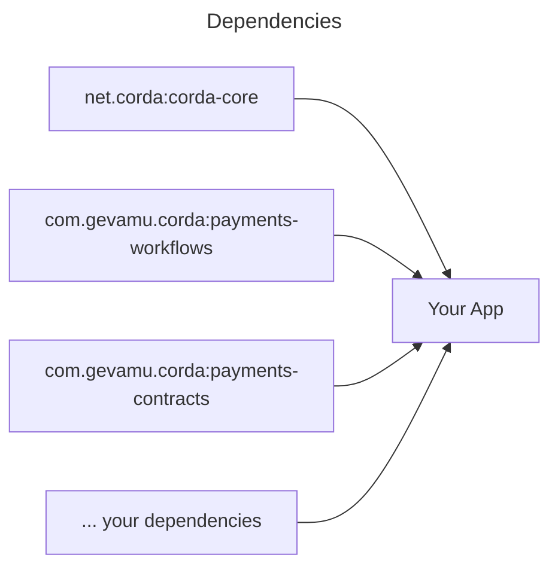
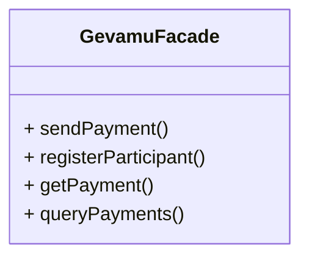

# Examples

This section contains examples of how to use the various features of the Gevamu Payments Solution.

## Architecture

Abstract CorDapp will be used as a sample to demonstrate possible architecture of your app integrated with the Gevamu Payments Solution.

Examples describe different methods in sample `GevamuFacade` class. This class implements facade pattern and provides a simple interface to the Gevamu Payments Solution.

