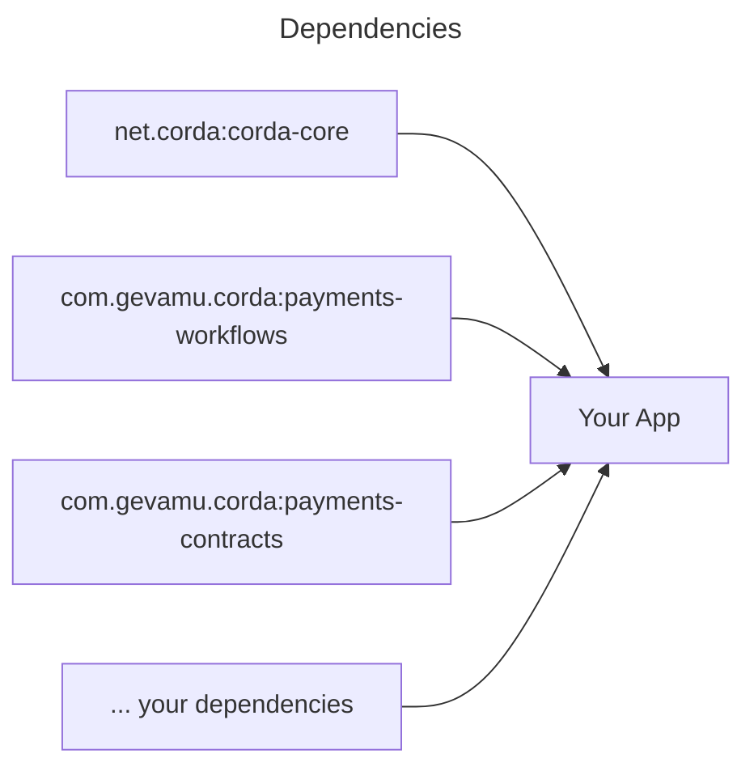
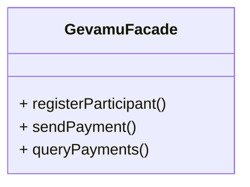

# Examples

This section contains examples illustrating how to use various features of the Gevamu Payments Solution.

## Architecture

To demonstrate a possible architecture of your app integrated with the Gevamu Payments Solution, this example uses an abstract CorDapp as a sample.



See a sample dependencies configuration in the `build.gradle.kts` file:

```kotlin [build.gradle.kts]
repositories {
    mavenCentral()
    // Repository with corda artifacts
    maven("https://software.r3.com/artifactory/corda")
}

dependencies {
    // Core Corda dependencies
    implementation("net.corda:corda-core:4.9.3")
    // Gevamu dependencies
    implementation("com.gevamu.corda:payments-workflows:0.1.0")
    implementation("com.gevamu.corda:payments-contracts:0.1.0")
}

```

Examples in this section demonstrate a sample implementation of the `GevamuFacade` class. This class utilizes the facade pattern and provides a simple interface to the Gevamu Payments Solution.



## Template

In order to have access to Corda flows and services, the `GevamuFacade` class should be implemented as a Corda service, see the example below:

```kotlin
import net.corda.core.node.AppServiceHub
import net.corda.core.node.services.CordaService
import net.corda.core.serialization.SingletonSerializeAsToken

@CordaService
class GevamuFacade(private val serviceHub: AppServiceHub): SingletonSerializeAsToken() {
    // Here goes the implementation of the GevamuFacade class
}
```

Read more about Corda services implementation in [Corda documentation](https://docs.r3.com/en/platform/corda/4.7/enterprise/cordapps/api-service-classes.html).
