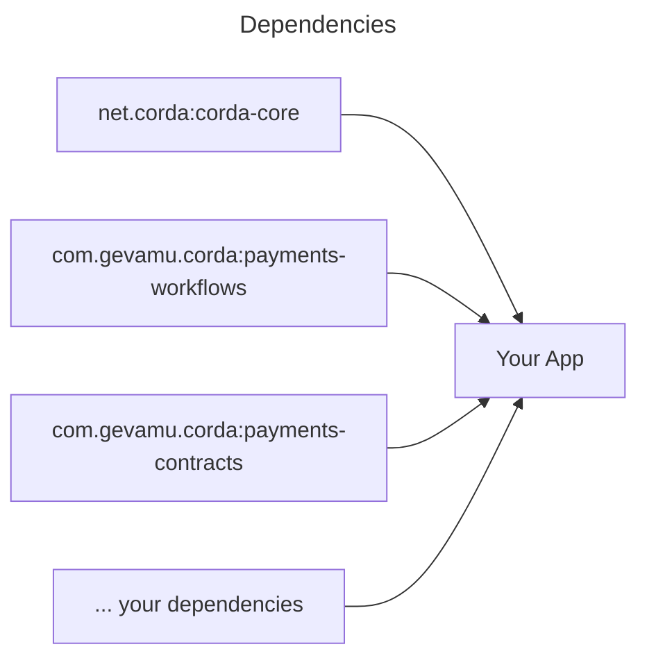
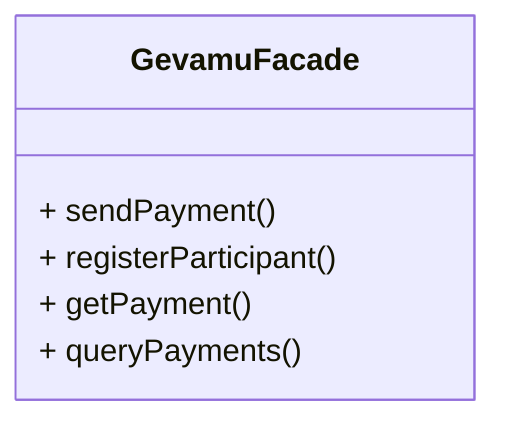

# Examples

This section contains examples of how to use the various features of the Gevamu Payments Solution.

## Architecture

Abstract CorDapp will be used as a sample to demonstrate possible architecture of your app integrated with the Gevamu Payments Solution.



Sample dependencies configuration in `build.gradle.kts` file:

```kotlin [build.gradle.kts]
repositories {
    mavenCentral()
    // Repository with corda artifacts
    maven("https://software.r3.com/artifactory/corda")
}

dependencies {
    // Core corda dependencies
    implementation("net.corda:corda-core:4.9.3")
    // Download SDK https://gevamu.github.io/corda-payments-sdk/
    implementation("com.gevamu.corda:payments-workflows:0.1.0")
    implementation("com.gevamu.corda:payments-contracts:0.1.0")
}

```

Examples describe different methods in sample `GevamuFacade` class. This class implements facade pattern and provides a simple interface to the Gevamu Payments Solution.



## Template

In order to have access to Corda flows and services, `GevamuFacade` class should be implemented as Corda service.

Read more about Corda services implementation in [Corda documentation](https://docs.r3.com/en/platform/corda/4.7/enterprise/cordapps/api-service-classes.html).

```kotlin
import net.corda.core.node.AppServiceHub
import net.corda.core.node.services.CordaService
import net.corda.core.serialization.SingletonSerializeAsToken

@CordaService
class GevamuFacade(private val serviceHub: AppServiceHub): SingletonSerializeAsToken() {
    // Here goes the implementation of the GevamuFacade class
}
```