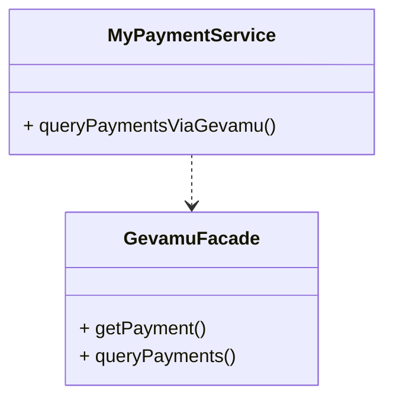
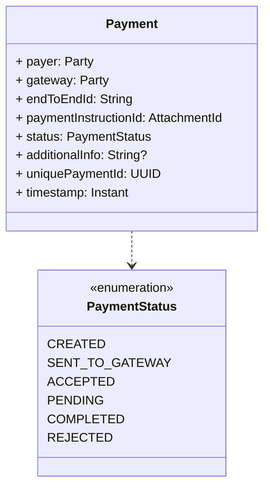

# Query payment states

Corda stores the state of a payment in the vault of the node that initiated the payment. So you can access the state of a payment by querying the vault.



## Payment structure

Structure of the [`Payment`](https://gevamu.github.io/corda-payments-sdk/payments-contracts/com.gevamu.corda.states/-payment/index.html) is as follows:



## Get single payment

In order to find unique payment it is necessary to search by `uniquePaymentId` field. That's whu `getPayment` method accepts `uniquePaymentId` as a parameter.

```kotlin
import java.util.UUID
import net.corda.core.node.services.vault.QueryCriteria

class GevamuFacade {
    fun getPayment(uniquePaymentId: UUID): StateAndRef<Payment>? {
        // Create custom query criteria to search by id
        val criteria = QueryCriteria.VaultCustomQueryCriteria(
            // Pay attention to method `equal` here. It is not `equals`!
            PaymentSchemaV1.PersistentPayment::uniquePaymentId.equal(uniquePaymentId)
        )
        // Query vault and return single payment state
        return serviceHub.vaultService.queryBy<Payment>(criteria).states.singleOrNull()
    }
}
```