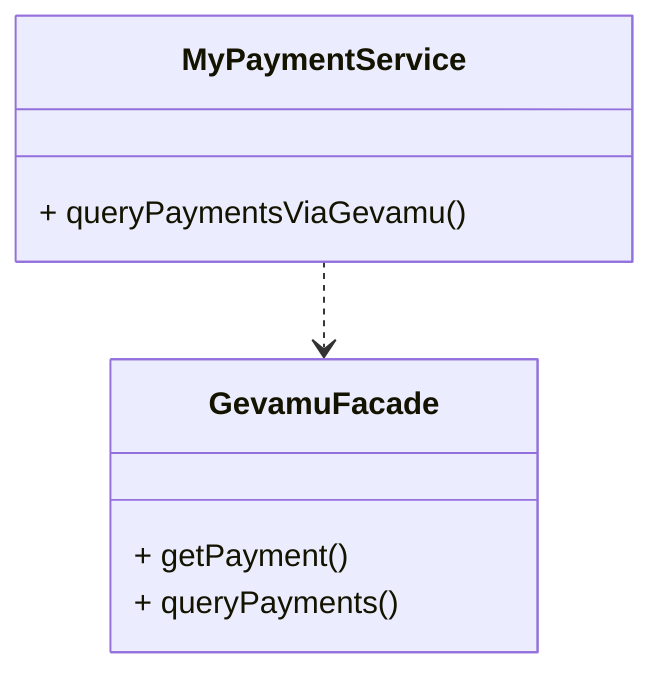
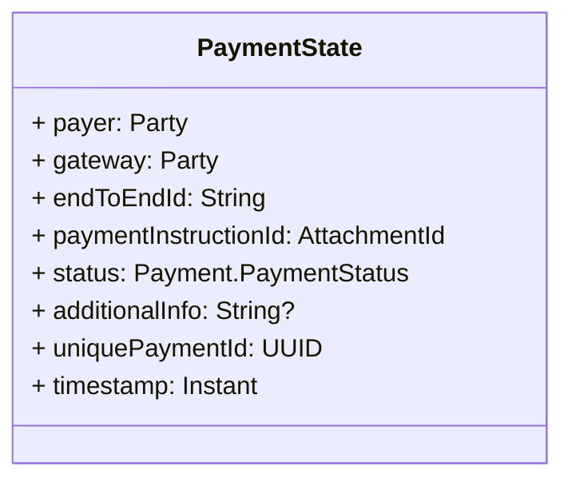

# Query payment states

Corda stores the state of a payment in the vault of the node that initiated the payment. So you can access the state of a payment by querying the vault.

Structure of the `PaymentState` is as follows:

