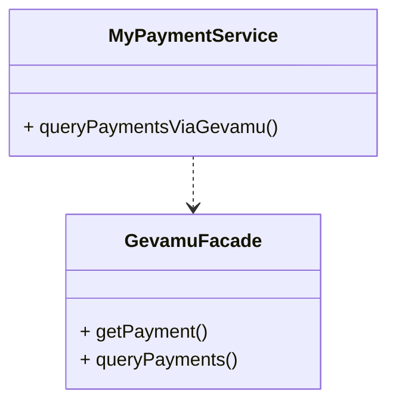
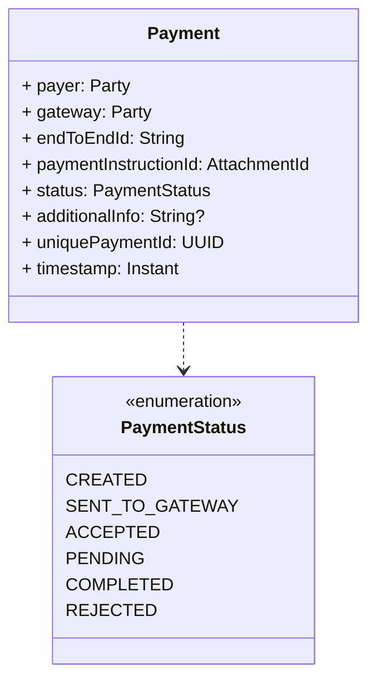

# Query payment states

Corda stores the state of a payment in the vault of the node that initiated the payment. So you can access the state of a payment by querying the vault.

## Payment structure

Structure of the [`Payment`](https://gevamu.github.io/corda-payments-sdk/payments-contracts/com.gevamu.corda.states/-payment/index.html) is as follows:

