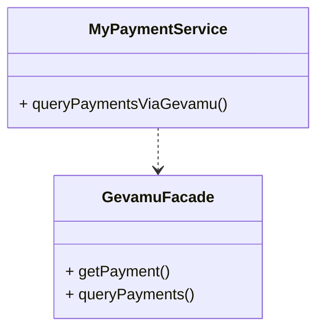
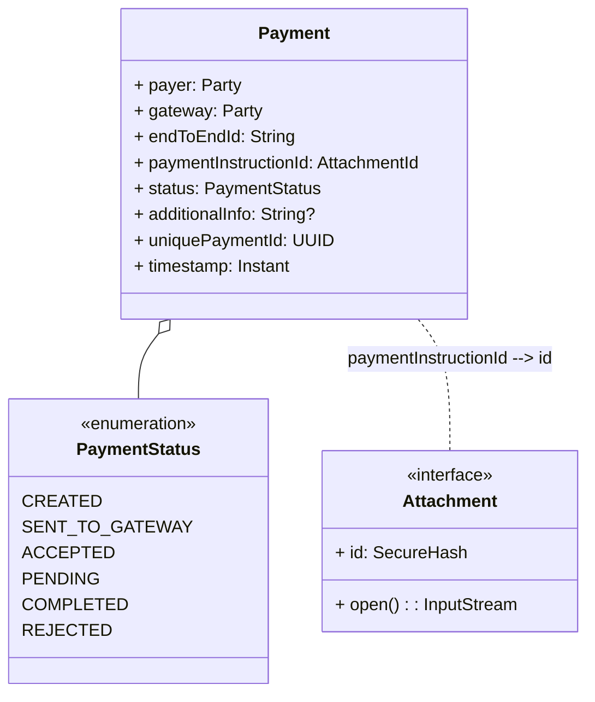

# Query payment states

Corda stores the state of a payment in the vault of the node that initiated the payment, so you can access the state of a payment by querying the vault.



## Payment structure

Structure of the [`Payment`](https://gevamu.github.io/corda-payments-sdk/payments-contracts/com.gevamu.corda.states/-payment/index.html) state is as follows:



::notice{info}
  Note that the full payment instruction is stored as a Corda [`Attachment`](https://docs.r3.com/en/api-ref/corda/4.8/open-source/javadoc/net/corda/core/contracts/Attachment.html). 
::

## About vault queries

Every Corda node has a vault that stores all the states created by the node (in our case, the `Payment` states).

Corda provides a powerful query language to search for states in the vault – learn more about [Writing vault queries](https://docs.r3.com/en/platform/corda/4.7/enterprise/cordapps/api-vault-query.html) in Corda documentation.

::notice{warning}
  Gevamu SDK doesn't provide any ready-to-use solution for querying by payments details stored in the attachment. However, you can create additional tables with the information needed for your business needs and use them in vault queries. 
  To get all payment details from the attachment, download and deserialize it.
 
::

To create queries for the Gevamu payments, use the following imports:

```kotlin
// Corda imports
import net.corda.core.node.services.vault.QueryCriteria
// Gevamu SDK imports
import com.gevamu.corda.schema.PaymentSchemaV1
import com.gevamu.corda.states.Payment
```

## Get a single payment

To find a unique payment, search by the `uniquePaymentId` field, accepted by the `getPayment` method as a parameter.

```kotlin
import java.util.UUID
import net.corda.core.node.services.vault.QueryCriteria
import com.gevamu.corda.schema.PaymentSchemaV1
import com.gevamu.corda.states.Payment

class GevamuFacade {
    fun getPayment(uniquePaymentId: UUID): StateAndRef<Payment>? {
        // Create custom query criteria to search by id
        val criteria = QueryCriteria.VaultCustomQueryCriteria(
            // Pay attention to method `equal` here. It is not `equals`!
            PaymentSchemaV1.PersistentPayment::uniquePaymentId.equal(uniquePaymentId)
        )
        // Query vault and return single payment state
        return serviceHub.vaultService.queryBy<Payment>(criteria).states.singleOrNull()
    }
}
```

## Query payments

Search criteria for payments can be unique to particular businesses. The following example shows a generic method for querying payments.

```kotlin
import net.corda.core.node.services.vault.QueryCriteria
import com.gevamu.corda.states.Payment

class GevamuFacade {
    fun queryPayments(criteria: QueryCriteria): List<StateAndRef<Payment>> {
        // Query vault and return list of payment states
        return serviceHub.vaultService.queryBy<Payment>(criteria).states
    }
}
```

### Query payments by date range

Querying objects by a date range is a common task for many businesses. The following example shows how to implement this functionality.

```kotlin
import java.time.Instant
import net.corda.core.node.services.vault.QueryCriteria
import com.gevamu.corda.schema.PaymentSchemaV1
import com.gevamu.corda.states.Payment

class GevamuFacade {
    fun queryPaymentsByDateRange(from: Instant, to: Instant): List<StateAndRef<Payment>> {
        // Create custom query criteria to search by date range
        val criteria = QueryCriteria.VaultCustomQueryCriteria(
            PaymentSchemaV1.PersistentPayment::timestamp.between(from, to)
        )
        // Query vault and return list of payment states
        return serviceHub.vaultService.queryBy<Payment>(criteria).states
    }
}
```