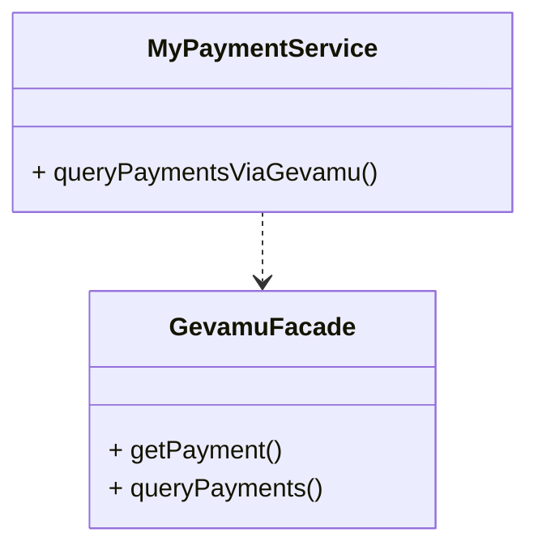
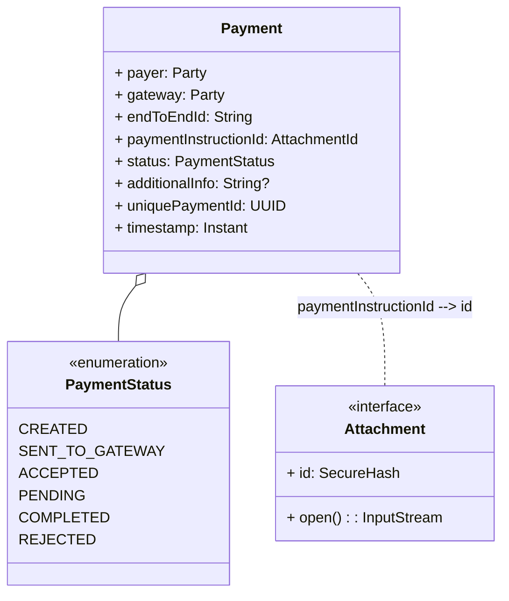

# Query payment states

Corda stores the state of a payment in the vault of the node that initiated the payment. So you can access the state of a payment by querying the vault.



## Payment structure

Structure of the [`Payment`](https://gevamu.github.io/corda-payments-sdk/payments-contracts/com.gevamu.corda.states/-payment/index.html) is as follows:

::notice{info}
  Pay attention, that full payment instruction is stored as Corda [`Attachment`](https://docs.r3.com/en/api-ref/corda/4.8/open-source/javadoc/net/corda/core/contracts/Attachment.html). So you need to download it and deserialize it to get all payment details.
::



## About vault queries

Every Corda node have a vault that stores all states that are created by the node. Our interest is in the `Payment` states.

Corda provides a powerful query language to search for states in the vault. You can find more information about it in the [Writing vault queries](https://docs.r3.com/en/platform/corda/4.7/enterprise/cordapps/api-vault-query.html) section of the documentation.

::notice{warning}
  Payment attachments are stored as files. So you can't use vault queries to search by payment details stored in attachments.
::

In order to create queries for Gevamu payments you need following imports:

```kotlin
// Corda imports
import net.corda.core.node.services.vault.QueryCriteria
// Gevamu SDK imports
import com.gevamu.corda.schema.PaymentSchemaV1
import com.gevamu.corda.states.Payment
```

## Get single payment

In order to find unique payment it is necessary to search by `uniquePaymentId` field. That's why `getPayment` method accepts `uniquePaymentId` as a parameter.

```kotlin
import java.util.UUID
import net.corda.core.node.services.vault.QueryCriteria
import com.gevamu.corda.schema.PaymentSchemaV1
import com.gevamu.corda.states.Payment

class GevamuFacade {
    fun getPayment(uniquePaymentId: UUID): StateAndRef<Payment>? {
        // Create custom query criteria to search by id
        val criteria = QueryCriteria.VaultCustomQueryCriteria(
            // Pay attention to method `equal` here. It is not `equals`!
            PaymentSchemaV1.PersistentPayment::uniquePaymentId.equal(uniquePaymentId)
        )
        // Query vault and return single payment state
        return serviceHub.vaultService.queryBy<Payment>(criteria).states.singleOrNull()
    }
}
```

## Query payments

Criterias for searching payments can be unique for different businesses. So next example shows generic method for querying payments.

```kotlin
import net.corda.core.node.services.vault.QueryCriteria
import com.gevamu.corda.states.Payment

class GevamuFacade {
    fun queryPayments(criteria: QueryCriteria): List<StateAndRef<Payment>> {
        // Query vault and return list of payment states
        return serviceHub.vaultService.queryBy<Payment>(criteria).states
    }
}
```

### Query payments by date range

Querying objects by date range is a common task for many businesses. So following example shows how to implement this functionality.

```kotlin
import java.time.Instant
import net.corda.core.node.services.vault.QueryCriteria
import com.gevamu.corda.schema.PaymentSchemaV1
import com.gevamu.corda.states.Payment

class GevamuFacade {
    fun queryPaymentsByDateRange(from: Instant, to: Instant): List<StateAndRef<Payment>> {
        // Create custom query criteria to search by date range
        val criteria = QueryCriteria.VaultCustomQueryCriteria(
            PaymentSchemaV1.PersistentPayment::timestamp.between(from, to)
        )
        // Query vault and return list of payment states
        return serviceHub.vaultService.queryBy<Payment>(criteria).states
    }
}
```