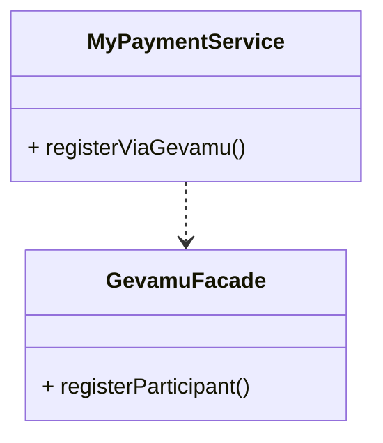
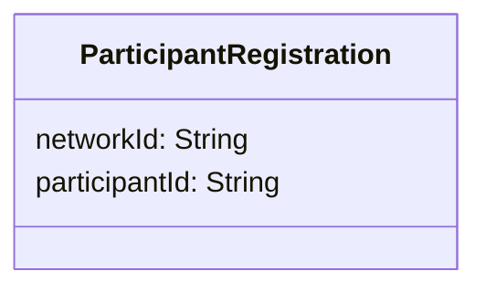

# Register

In order to send payments, you need to register a participant within the Gevamu Payments Solution. This example shows how to register a participant node.



The Gevamu Payments Solution provides [`RegisterParticipantFlow`](https://gevamu.github.io/corda-payments-sdk/payments-workflows/com.gevamu.corda.flows/-register-participant-flow/index.html) as the flow for registration execution and [`ParticipantRegistration`](https://gevamu.github.io/corda-payments-sdk/payments-workflows/com.gevamu.corda.flows/-participant-registration/index.html) as the participant registration record. 

## Registering a Participant Node using classes provided by Gevamu SDK 

An example of calling the `RegisterParticipantFlow` is shown below. 

```kotlin
import com.gevamu.corda.flows.ParticipantRegistration
import com.gevamu.corda.flows.RegisterParticipantFlow
import net.corda.core.identity.Party
import net.corda.core.node.services.CordaService

class GevamuFacade {
  
  fun registerParticipant(gateway: Party): ParticipantRegistration {
        val flowHandle = serviceHub.startFlow(RegisterParticipantFlow(gateway))
        return flowHandle.returnValue.get()
    }
}
```

The `RegisterParticipantFlow` requests registration from the particular Gevamu Gateway node.
The Gateway required for registration is identified by the `Party` class.
Depending on how you design your CorDapp, the flow to register the participant node can be started with an RPC call or using the [`serviceHub`](https://docs.r3.com/en/api-ref/corda/4.8/open-source/kotlin/corda/net.corda.core.node/-service-hub/index.html) as in the example above. 

After successful registration, the Gateway node returns the participant registration record with a Participant Id and the BNO Network Id.
The participant registration record in the form of a data class `ParticipantRegistration` is shown below.


## Check if the participant node was registered

If the node has been registered with a Gateway node it always returns the existing credentials. 
Methods in the `ParticipantRegistration` data class verifies if the returned participant id is unique allowing you to confirm that the participant node has already been registered with a particular Gateway node. 


