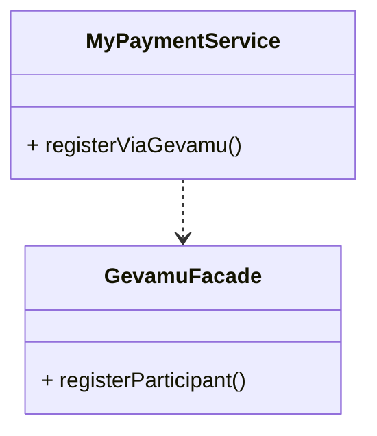

# Register

In order to send payments, you need to register a participant within the Gevamu Payments Solution. This example shows how to register a participant node.



This is done by calling the `RegisterParticipantFlow` flow.

## Registration Summary
1. The Participant requests to join the network through the Payments node. 
2. The Payments node should request the Gevamu Gateway Node for registration.
    A gateway exists for each bank/PSP.
3. The Gevamu gateway provides the Payments Node with a ParticipantId and the NetworkID of the BNO.

## Registration response structure

The 2 classes provided by the Gevamu SDK for registration are:
1. `ParticipantRegistration` class
2. `RegisterParticipantFLow` class

Integrate these 2 classes by importing them from `com.gevamu.corda.flows` package. 

### Process

The registration process begins when the `RegisterParticipantFLow` starts a flow from the participant node to the gevamu gateway node. 
The flow returns a `ParticipantRegistration` (Kotlin Data class) with a Participant ID for user and Network ID of BNO.
The registration flow can be suspended. 


### Implementation in Facade 

Sample application `GevamuFacade` built to demonstrate how you may utilize the SDK to build you own app

#### Code 

The function below is an example of implementation of registration within the Facade class

```kotlin
import com.gevamu.corda.flows.ParticipantRegistration
import com.gevamu.corda.flows.RegisterParticipantFlow
import net.corda.core.identity.Party
import net.corda.core.node.services.CordaService

  fun registerParticipant(gateway: Party): ParticipantRegistration {
        val flowHandle = serviceHub.startFlow(RegisterParticipantFlow(gateway))
        return flowHandle.returnValue.get()
    }

```


