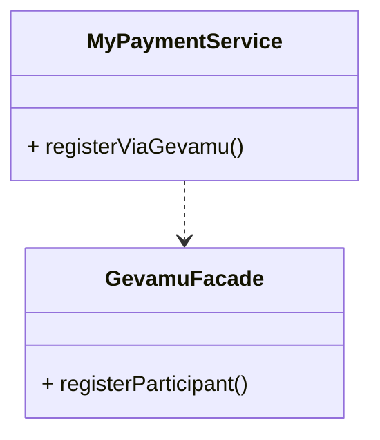

# Register

In order to send payments, you need to register a participant within the Gevamu Payments Solution. This example shows how to register a participant node.

This is done by calling the `RegisterParticipantFlow` flow.

## Registration Summary
The participant requests to join the payments network, the Gevamu Payments Gateway provides the participant with the Network ID of the BNO and assigns the Participant ID, and then registers the Payments CorDapp. 

## Participant Registration class

This data class: 

- has parameters `participantId` and a `networkId`

## Register Participant Flow Class

This class is the start of the flow to register the participant and the flow starts by RPC. (see annotations `@InitiatingFlow` `@StartableByRPCclass`).
The `party` object represents the identity of the Gevamu Gateway Corda node (node where the participant wants to register).
The flow returns the `ParticipantRegistration` object when it is completed.
The call() function executes the actual logic of the flow, and this flow can be suspended (`@Suspendable`).

