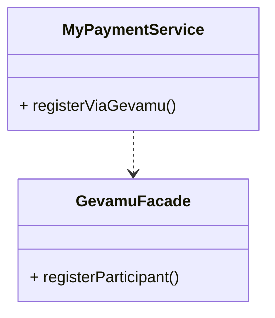

# Register

In order to send payments, you need to register a participant within the Gevamu Payments Solution. This example shows how to register a participant node.

This is done by calling the `RegisterParticipantFlow` flow.