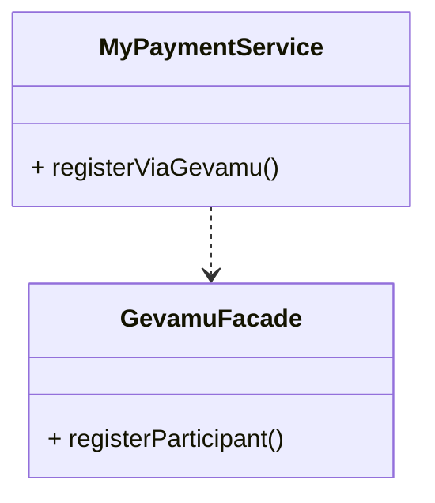

# Register

In order to send payments, you need to register a participant within the Gevamu Payments Solution. This example shows how to register a participant node.



This is done by calling the `RegisterParticipantFlow` flow.

## Registration Summary
The participant requests to join the payments network, the Gevamu Payments Gateway provides the participant with the Network ID of the BNO and assigns the Participant ID, and then registers the Payments CorDapp. 

1. See `payments-workflows/src/main/kotlin/com/gevamu/corda/flows/RegisterParticipantFlow.kt` from the Payments SDK. 

2. Integrate the classes from the above Kotlin file from Payments SDK into the CorDapp to register a Participant via Gevamu.

3. The file contains the 2 classes that are required to register a participant via Gevamu.

- The Register Participant Flow Class initiates the flow and registers the participant

- The Participant Registration class is a data class to hold information

4. After adding the classes, configure the app to use the Corda dependencies ( required imports can be viewed in the  RegisterParticipantFlow.kt )

5. Make any necessary modifications to the ParticipantRegistration and RegisterParticipantFlow classes to fit the specific requirements of your CorDapp

6. Register the flow in your CordappConfig file by adding an entry for it in the flows section. This will allow the flow to be invoked from other nodes in the network.

7. Deploy your CorDapp to your Corda nodes

## Participant Registration class

```kotlin

@CordaSerializabledata 

data class ParticipantRegistration(val participantId: String, val networkId: String) : Serializable {
    override fun equals(other: Any?): Boolean =
        (other is ParticipantRegistration) && this.participantId == other.participantId    override fun hashCode(): Int {
        return this.participantId.hashCode()
    }

    companion object {
        private const val serialVersionUID: Long = 1L    }
}

```

This data class: 

- has parameters `participantId` and a `networkId`

- checks if the participant id matches any existing id

- returns the participant id as unique integer value that is always the same when generated

- creates an identification number of the participant registration

## Register Participant Flow Class

```kotlin 

@InitiatingFlow
@StartableByRPCclass

class RegisterParticipantFlow(private val gateway: Party) : FlowLogic<ParticipantRegistration>() {
    override val progressTracker = ProgressTracker()
    
    @Suspendable    
    override fun call(): ParticipantRegistration {
        val gatewaySession: FlowSession = initiateFlow(gateway)
        return gatewaySession.receive<ParticipantRegistration>().unwrap { it }    }
}

```
This class is the start of the flow to register the participant and the flow starts by RPC. (see annotations `@InitiatingFlow` `@StartableByRPCclass`).
The class contains a Tracker to track the corda flow.
The `party` object represents the identity of the Gevamu Gateway Corda node (node where the participant wants to register).
`FlowLogic<ParticipantRegistration>` the flow returns the `ParticipantRegistration` object when it is completed.
The call() function executes the actual logic of the flow, and this flow can be suspended (`@Suspendable`).

