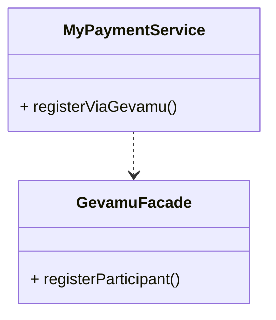

# Register

In order to send payments, you need to register a participant within the Gevamu Payments Solution. This example shows how to register a participant node.



This is done by calling the `RegisterParticipantFlow` flow.

```kotlin
import com.gevamu.corda.flows.ParticipantRegistration
import com.gevamu.corda.flows.RegisterParticipantFlow
import net.corda.core.identity.Party
import net.corda.core.node.services.CordaService

  fun registerParticipant(gateway: Party): ParticipantRegistration {
        val flowHandle = serviceHub.startFlow(RegisterParticipantFlow(gateway))
        return flowHandle.returnValue.get()
    }

```


