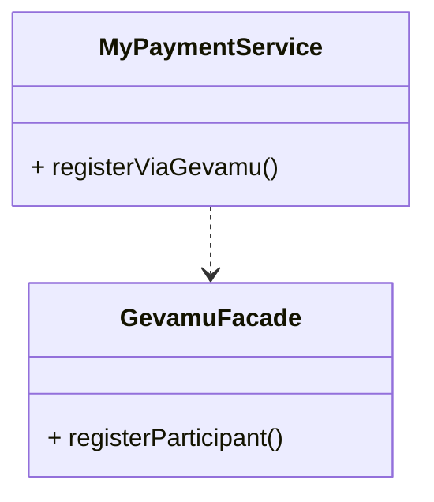
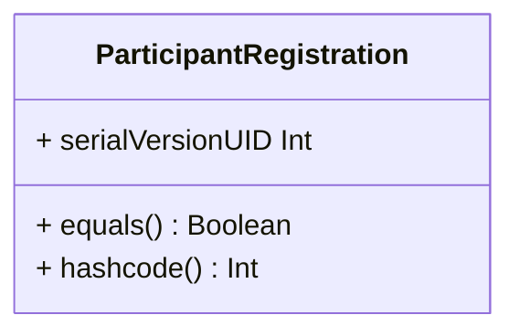
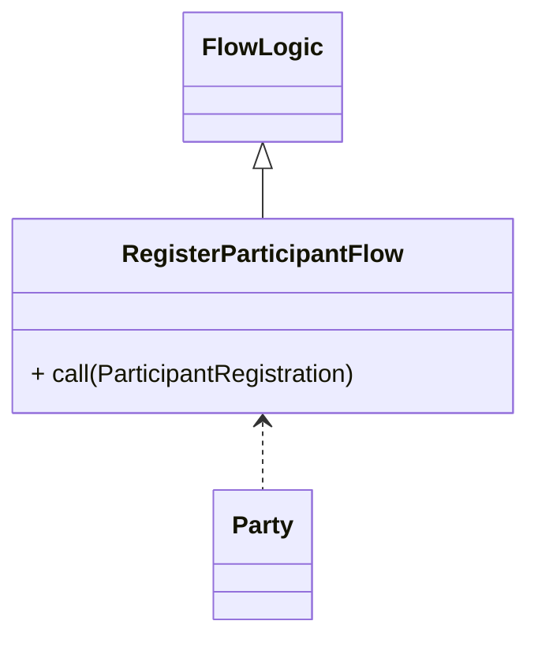

# Register

In order to send payments, you need to register a participant within the Gevamu Payments Solution. This example shows how to register a participant node.

This is done by calling the `RegisterParticipantFlow` flow.

## Registration Summary
1. The Participant requests to join the BNO through the Payments node
2. The Payments node requests the Gevamu Gateway Node for registration
3. The Gevamu gateway provides the Payments Node with a ParticipantId and the NetworkID of the BNO

## Participant Registration class

A Kotlin data class that holds the Participant Id and the Network Id

## Register Participant Flow Class

This class initiates the flow by RPC to register the participant. 
The call() method executes the actual logic of the flow by starting a flow session to the correct Gevamu Gateway Corda node (node where the participant wants to register).
This flow can be suspended.
The correct Gevamu Gateway Node is identified through the parameter gateway of type Party(Party is imported from the corda identity package)
The flow returns the participant ID and network Id after successfully registering the participant.

