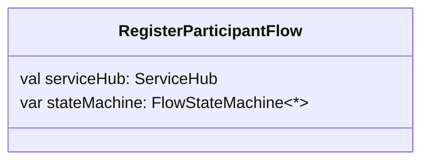
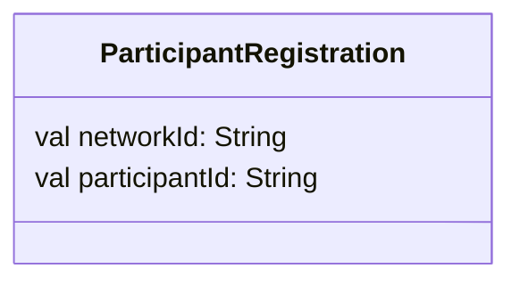

# Register

In order to send payments, you need to register a participant within the Gevamu Payments Solution. This example shows how to register a participant node.


This is done by calling the `RegisterParticipantFlow` flow.

An example of calling the `RegisterParticipantFlow` is shown below. 

```kotlin
import com.gevamu.corda.flows.ParticipantRegistration
import com.gevamu.corda.flows.RegisterParticipantFlow
import net.corda.core.identity.Party
import net.corda.core.node.services.CordaService

class GevamuFacade {
  
  fun registerParticipant(gateway: Party): ParticipantRegistration {
        val flowHandle = serviceHub.startFlow(RegisterParticipantFlow(gateway))
        return flowHandle.returnValue.get()
    }
}
```
In the example above, the developer has imported and utilized the classes required for registration into their CordApp. 

The `RegisterParticipantFlow` requests registration from the particular Gevemu Gateway node.
The Gateway required for registration is identified by the Party class.
Depending on how you design your CordApp, the flow to register the participant node can be started with an RPC call or using the `serviceHub` as in the example above. 

Class diagram showing some of the properties of `RegisterParticipantFlow` class.
For complete details about the class go [here](https://gevamu.github.io/corda-payments-sdk/payments-workflows/com.gevamu.corda.flows/-register-participant-flow/index.html).


After successful registeration, the Gateway node will return a Participant Id and the BNO Network Id.
The returned information is held in the data class `ParticipantRegistration`. 

Class diagram showing some of the properties of `ParticipantRegistration` class. 
For complete details about the class go [here](https://gevamu.github.io/corda-payments-sdk/payments-workflows/com.gevamu.corda.flows/-participant-registration/index.html).




