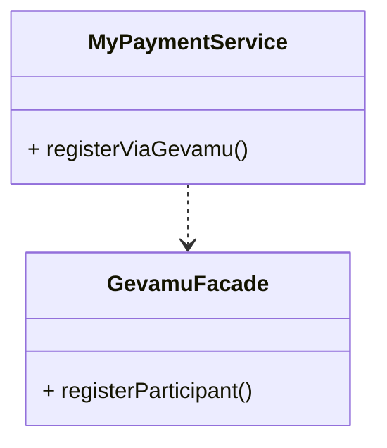
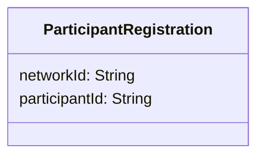

# Participant registration

In order to send payments, you need to register a Participant within the Gevamu Payments Solution. This example shows how to register a Participant node.



The Gevamu Payments Solution provides [`RegisterParticipantFlow`](https://gevamu.github.io/corda-payments-sdk/payments-workflows/com.gevamu.corda.flows/-register-participant-flow/index.html) as the flow for registration and [`ParticipantRegistration`](https://gevamu.github.io/corda-payments-sdk/payments-workflows/com.gevamu.corda.flows/-participant-registration/index.html) as the participant registration record. 

## Registering a Participant Node using classes provided by Gevamu SDK 

See an example of calling `RegisterParticipantFlow` below: 

```kotlin
import com.gevamu.corda.flows.ParticipantRegistration
import com.gevamu.corda.flows.RegisterParticipantFlow
import net.corda.core.identity.Party
import net.corda.core.node.services.CordaService

class GevamuFacade {
  
  fun registerParticipant(gateway: Party): ParticipantRegistration {
        val flowHandle = serviceHub.startFlow(RegisterParticipantFlow(gateway))
        return flowHandle.returnValue.get()
    }
}
```

`RegisterParticipantFlow` requests registration from the Gevamu Gateway node identified via the `Party` instance.

You may choose to design your CorDapp so that it initiates the Participant node registration flow via an RPC call or using the [`serviceHub`](https://docs.r3.com/en/api-ref/corda/4.8/open-source/kotlin/corda/net.corda.core.node/-service-hub/index.html) as in the example above. 

Upon successful registration, the Payment Gateway node returns the participant registration record with the Participant ID and the BNO Network ID.
The structure of the `ParticipantRegistration` data class is shown below.


 


