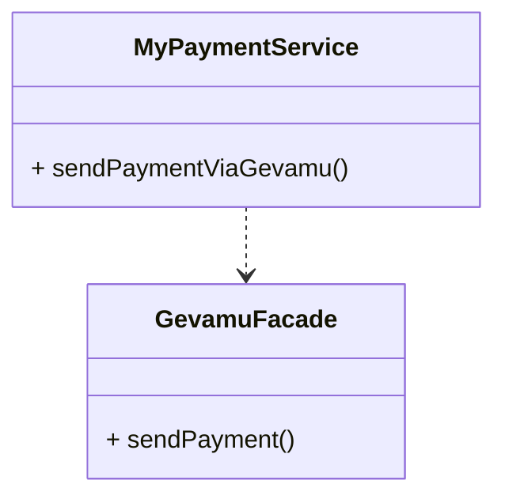

# Send Payment

This example shows how to send a payment from one account to another via Gevamu Payments Solution.



```kotlin
class MyPaymentService(private val gevamuFacade: GevamuFacade) {
    fun sendPaymentViaGevamu() {
        // Create payment instruction with payment details
        val paymentInstruction = PaymentInstruction(/* payment details */)
        
        // Specify gateway node for payment processing
        val gateway = Party(/* gateway node data */)
        
        // Use GevamuFacade to send payment instruction to gateway node
        gevamuFacade.sendPayment(paymentInstruction, gateway)
    }
}

class GevamuFacade {
    fun sendPayment(paymentInstruction: PaymentInstruction, gateway: Party): List<StateAndRef<Payment>> {
        // Implementation of payment processing via Gevamu
    }
}
```

To make a transaction as a network participant, enter the Participant ID and your target Business Network name obtained during onboarding.
After that, pass the desired transaction amount along with Debtor and Creditor details.
The transaction now has the ‘Created’ status. 
Once payment instruction is received, the Payment Gateway validates its node identity as well as the Participant ID. If the validation passes, the Payment Gateway sends the instruction to an external Payment Service Provider's gateway and returns the ‘Sent to Gateway’ status back to the Participant.
The Payment Service Provider can accept or reject the transaction.


The Participant initiates the payment transaction off-chain via the provided interface in MyPaymentService.
The payment request is handled by a web server on the Participant’s side and sent via Corda RPC to the custom Payment CorDapp installed on-chain on the Participant’s node.
The custom Payment CorDapp passes the payment request as an instruction formatted according to the industry-accepted payment standard (for example, ISO 20022-formatted XML) to the Gevamu Payment SDK.
The SDK pre-validates the payment instruction and creates a state (or several states if multiple payments are instructed) with an attachment containing the original payment instruction.
The payment instruction is sent to the Gevamu Payment Gateway.
The Gevamu Payment Gateway validates the payment instruction.

The payment gateway checks if the Participant is authorized to submit this payment request, it validates the payment instruction from the following aspects:
- Node Identity – checking whether a payment request is received from the node that initially registered the Participant initiating the request;
- Participant ID – checking whether the Participant is registered with the Payment network and if Participant ID is registered to the Participant’s node;

If not valid, the process is terminated and a corresponding status is sent back to the Participant’s CorDapp.
If valid, its status is updated (to reflect that the payment instruction is accepted by the Payment Gateway for further delivery); the payment instruction itself is sent to the external gateway of the PSP.

Once the PSP replies to the payment request, a returned payment status is communicated back to the Participant’s node.
The status can be Pending, Accepted or Rejected.
The updated status is made available as a new Corda state in the payment statuses chain.

The participant’s Cordapp subscribes to the payment state updates to be notified on Payment processing progress.
If the payment instruction cannot be immediately settled by the PSP, the Payment Gateway monitors the PSP for payment status updates.
Once received, the updated payment request status is communicated to the Participant’s node.