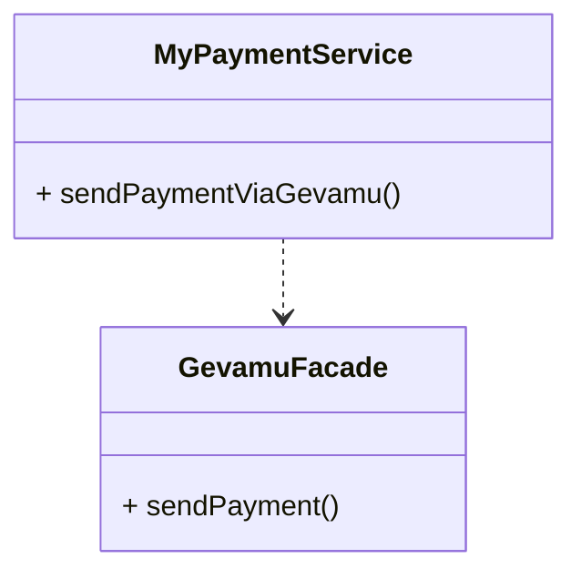

# Send Payment

This example shows how to send a payment from one account to another via Gevamu Payments Solution.

```mermaid
classDiagram
  class MyPaymentService {
    + sendPaymentViaGevamu()
  }
  class GevamuFacade {
    + sendPayment()
  }

  MyPaymentService ..> GevamuFacade
```