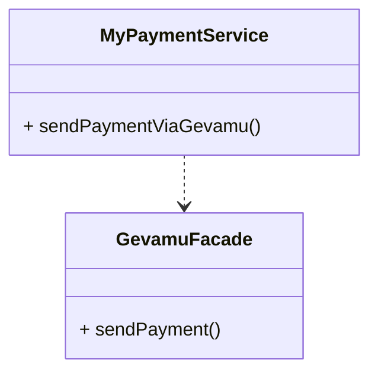
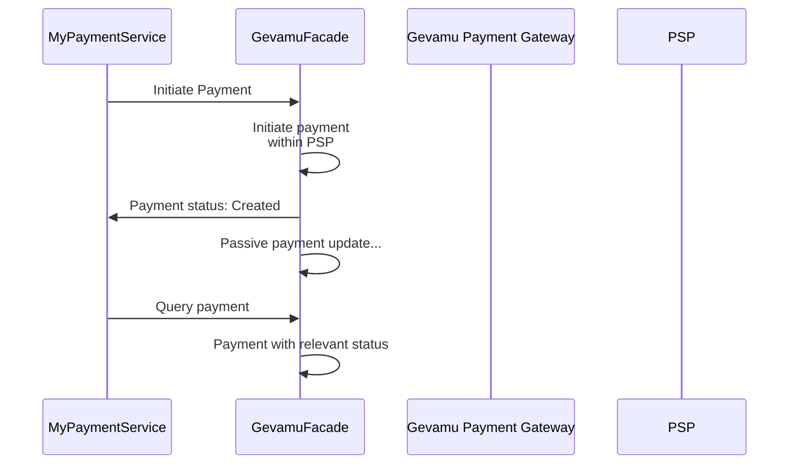

# Send Payment

This example shows how to send a payment from one account to another via Gevamu Payments Solution.



```kotlin
class MyPaymentService(private val gevamuFacade: GevamuFacade) {
    fun sendPaymentViaGevamu() {
        // Create payment instruction with payment details
        val paymentInstruction = PaymentInstruction(/* payment details */)
        
        // Specify gateway node for payment processing
        val gateway = Party(/* gateway node data */)
        
        // Use GevamuFacade to send payment instruction to gateway node
        gevamuFacade.sendPayment(paymentInstruction, gateway)
    }
}

class GevamuFacade(private val serviceHub: AppServiceHub): SingletonSerializeAsToken() {

  fun sendPayment(
    paymentInstruction: PaymentInstruction,
    gateway: Party
  ): List<StateAndRef<Payment>> {
    val flowHandle = serviceHub.startFlow(PaymentFlow(paymentInstruction, gateway, UUID.randomUUID()))
    return flowHandle.returnValue.get()
  }

```

To make a transaction as a network participant, enter the Participant ID and your target Business Network name obtained during onboarding.
After that, pass the desired transaction amount along with Debtor and Creditor details.
The transaction now has the ‘Created’ status. 

Once payment instruction is received, the Payment Gateway validates its node identity as well as the Participant ID. If the validation passes, the Payment Gateway sends the instruction to an external Payment Service Provider's gateway and returns the ‘Sent to Gateway’ status back to the Participant.
The Payment Service Provider can accept or reject the transaction.

