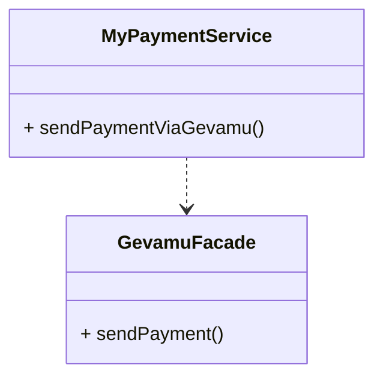
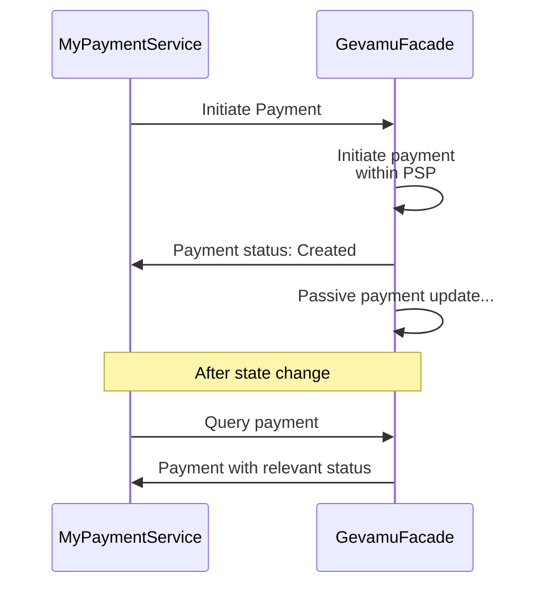
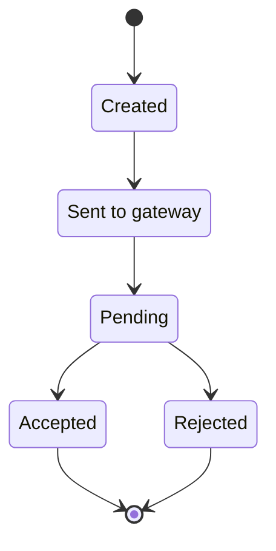

# Send Payment

This example shows how to send a payment from one account to another via Gevamu Payments Solution.



## Program implementation

Sending payment is quite simple operation. It includes only call of `PaymentFlow`. 

But before starting the flow you should provide payment instruction. It should be created according to chosen payment standard.

```kotlin
class MyPaymentService(private val gevamuFacade: GevamuFacade) {
    fun sendPaymentViaGevamu() {
        // Create payment instruction with payment details
        val paymentInstruction = PaymentInstruction(/* payment details */)
        
        // Specify gateway node for payment processing
        val gateway = Party(/* gateway node data */)
        
        // Use GevamuFacade to send payment instruction to gateway node
        gevamuFacade.sendPayment(paymentInstruction, gateway)
    }
}

class GevamuFacade(private val serviceHub: AppServiceHub): SingletonSerializeAsToken() {

  fun sendPayment(
    paymentInstruction: PaymentInstruction,
    gateway: Party
  ): List<StateAndRef<Payment>> {
    val flowHandle = serviceHub.startFlow(PaymentFlow(paymentInstruction, gateway, UUID.randomUUID()))
    return flowHandle.returnValue.get()
  }
}
```

## Transactions lifecycle

Once payment instruction is received, the Gevamu Payment Solution validates and authorizes (by checking node identity and the Participant ID) the payment.
If the validation passes, the Payment Gateway sets the payment status to ‘Sent to Gateway’. Status change is communicated back to the Participant's node.
Transaction can be accepted or rejected by the Payment Service Provider.

To make a transaction as a network participant, describe Payment in one of formats listed in [`PaymentInstructionFormat`](https://gevamu.github.io/corda-payments-sdk/payments-workflows/com.gevamu.corda.flows/-payment-instruction-format/index.html) enum.

You can find sequence diagrams of payment processing and payment state transition below:



