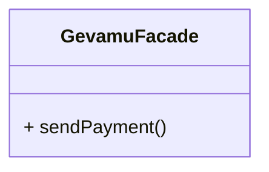
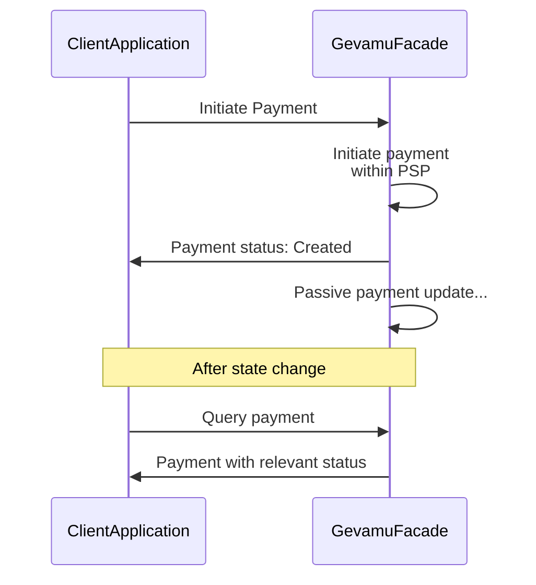

# Sending Payments

This example shows how to send a payment from one account to another via the Gevamu Payments Solution.



## Implementation

Sending a payment is a one-step operation, consisting of a single `PaymentFlow` call. 

Before starting the flow, provide a payment instruction created according to a chosen payment standard:

```kotlin
class ClientApplication(private val gevamuFacade: GevamuFacade) {
    fun sendPaymentViaGevamu() {
        // Create payment instruction with payment details
        val paymentInstruction = PaymentInstruction(/* payment details */)
        
        // Specify gateway node for payment processing
        val gateway = Party(/* gateway node data */)
        
        // Use GevamuFacade to send payment instruction to gateway node
        gevamuFacade.sendPayment(paymentInstruction, gateway)
    }
}

class GevamuFacade(private val serviceHub: AppServiceHub): SingletonSerializeAsToken() {
  fun sendPayment(
    paymentInstruction: PaymentInstruction,
    gateway: Party
  ): List<StateAndRef<Payment>> {
    val flowHandle = serviceHub.startFlow(PaymentFlow(paymentInstruction, gateway))
    return flowHandle.returnValue.get()
  }
}
```

## Transaction lifecycle

When creating a payment transaction, use one of the formats listed in [`PaymentInstructionFormat`](https://gevamu.github.io/corda-payments-sdk/payments-workflows/com.gevamu.corda.flows/-payment-instruction-format/index.html) enum.

Once a payment instruction is received, the Gevamu Payment Solution validates the payment by checking the Participant node's identity and the Participant ID, and authorizes it.

If the validation passes, the Payment Gateway sets the payment status to ‘Sent to Gateway’ and communicates the status change back to the Participant's node.

If a payment initiation request contains multiple payment instructions, multiple payment states will be created and independently updated.

On the side of the Payment Services Provider, the transaction can be accepted or rejected.
If payment cannot be immediately completed, the "Pending" status is returned. 
Once the Gevamu Payment Gateway receives a new status from the PSP, the payment state will be updated with the final status.

You can find sequence diagrams of payment processing and payment state transition below:



::notice{info}

Find more information about payment queries [here](query-payment-states).

::


