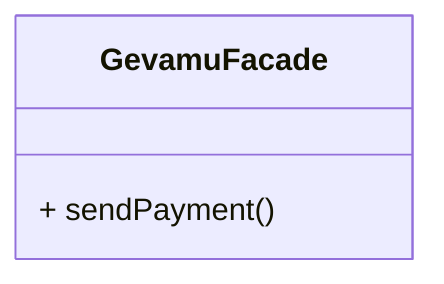
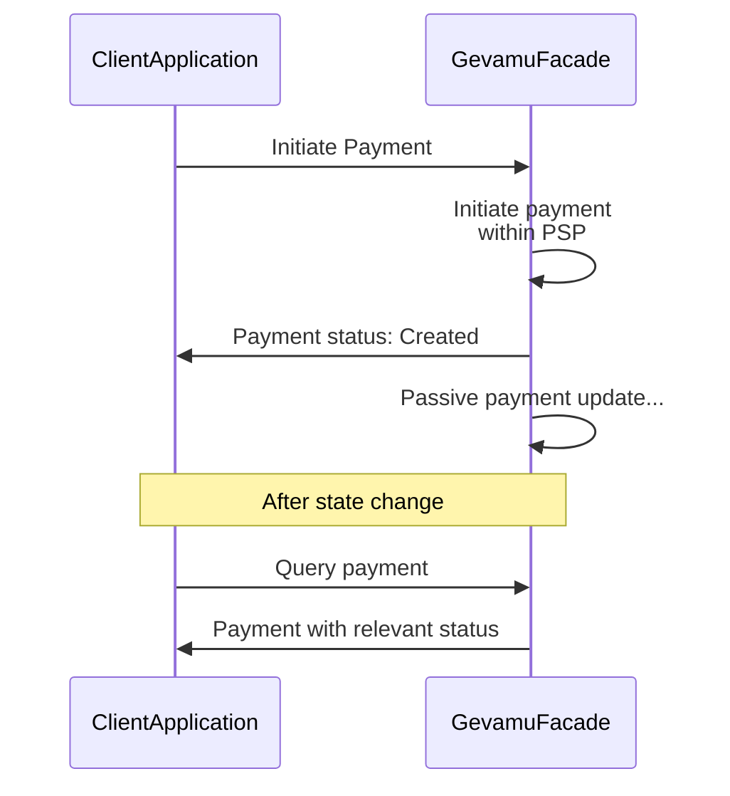
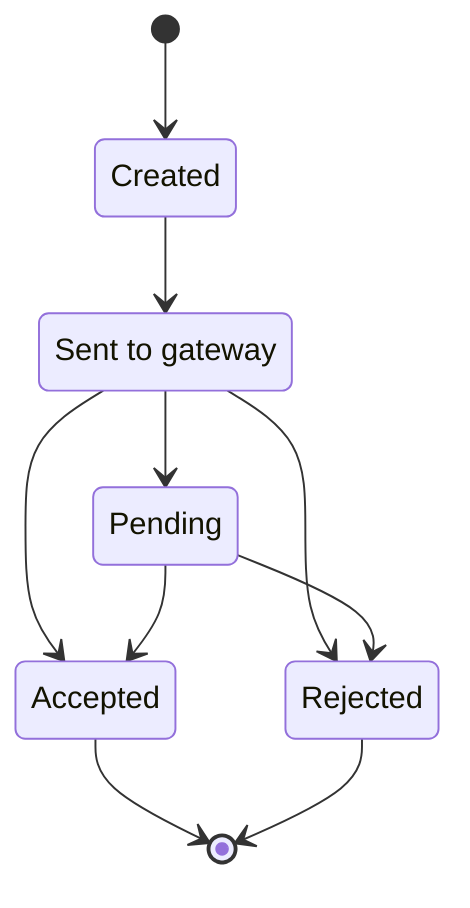

# Send Payment

This example shows how to send a payment from one account to another via Gevamu Payments Solution.



## Program implementation

Sending a payment is a one-step operation, consisting of a single `PaymentFlow` call. 

Before starting the flow, you should provide a payment instruction created according to a chosen payment standard.

```kotlin
class ClientApplication(private val gevamuFacade: GevamuFacade) {
    fun sendPaymentViaGevamu() {
        // Create payment instruction with payment details
        val paymentInstruction = PaymentInstruction(/* payment details */)
        
        // Specify gateway node for payment processing
        val gateway = Party(/* gateway node data */)
        
        // Use GevamuFacade to send payment instruction to gateway node
        gevamuFacade.sendPayment(paymentInstruction, gateway)
    }
}

class GevamuFacade(private val serviceHub: AppServiceHub): SingletonSerializeAsToken() {
  fun sendPayment(
    paymentInstruction: PaymentInstruction,
    gateway: Party
  ): List<StateAndRef<Payment>> {
    val flowHandle = serviceHub.startFlow(PaymentFlow(paymentInstruction, gateway))
    return flowHandle.returnValue.get()
  }
}
```

## Transactions lifecycle

Once payment instruction is received, the Gevamu Payment Solution validates the payment by checking node identity and the Participant ID, and authorizes it.
If the validation passes, the Payment Gateway sets the payment status to ‘Sent to Gateway’. 
Status change is communicated back to the Participant's node.
If a payment initiation request contains multiple payment instructions, multiple payment states will be created and independently updated.
Transaction can be accepted or rejected by the Payment Service Provider.
If payment cannot be immediately completed, "Pending" status is returned. 
The payment state will be updated with the final status when the Gevamu gateway receives new status from the PSP.

Payment should be described in one of formats listed in [`PaymentInstructionFormat`](https://gevamu.github.io/corda-payments-sdk/payments-workflows/com.gevamu.corda.flows/-payment-instruction-format/index.html) enum.

You can find sequence diagrams of payment processing and payment state transition below:



::notice{info}

Check more info about payment query [here](query-payment-states)

::

